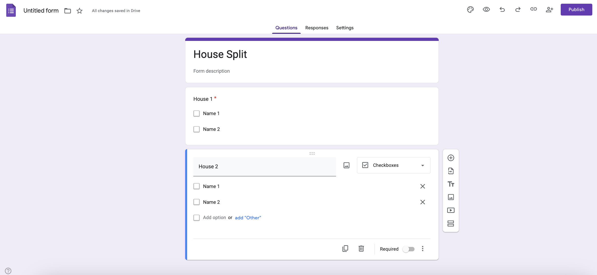
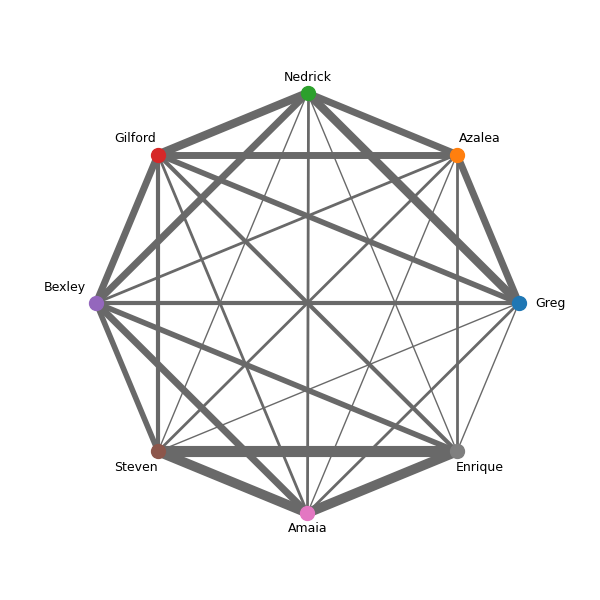

# House Splitter
### Background
When our large group of friends faced the tricky challenge of deciding how to split into different houses, it quickly became clear that doing it fairly and without hurting anyone’s feelings, was no easy task. But as a data scientist, I saw a way forward: let the data guide us.

So, I built a tool designed to take the guesswork and awkwardness out of the equation. It lets everyone indicate who they’d like to live with, then visualizes that input through a sociogram highlighting the strongest connections, along with a compatibility chart that offers clear, data-driven insights. The goal? A smoother, more objective way to form house groups—based not on guesswork, but on real preferences.

----
## How to use
Gather data using Google Forms in the layout below:
\

**Make sure to use required questions and use a checkbox to allow multiple options to be picked**
\
\
Once all results have been collected, extract the data from the ***Responses*** tab, and click on ***View in Sheets***.
Export this Google Sheet into a **.csv** file, you do not need to change anything in the table. \
Move this **.csv** file into the same folder as this code. Replace the example **.csv** file, and make sure the **.csv** file is labelled **House Split (Responses).csv**. If you do not want this name, or you wish to keep the file elsewhere you will need to go into the **house-picker.py** file and change this line
`run = HousePicker(csv_filepath="House Split (Responses).csv")` to the appropriate filepath.
Then run **house-picker.py**. This will generate the network graph (a.k.a. the sociogram). 

#### Example output

